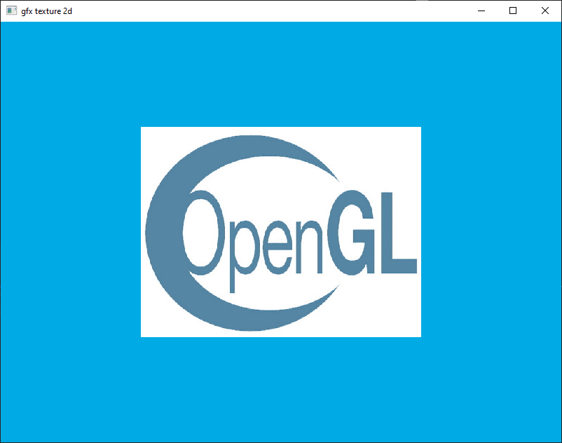

# gfxtoolbox
small gfx library with examples with OpenGL4 C++

# Examples

| | | |
|:-------------------------:|:-------------------------:|:-------------------------:|
|01 - Window    | 02 - Triangle   | 03 - Indexed   |
|04 - Colors    | 05 - Texture 1D   | 06 - Texture 2D   |
|07 - Box 3D    |08 - Orbit Camera   | 09 - Grid 3D  |
|10 - Imgui     |11 - Framebuffer    | 12 - Checker Pattern    |
|13 - Point Light    |14 - Depth Buffer    |15 - Geometry Shader    |
|16 - Shadow Mapping    |17 - Sky Shader    |18 - Clouds Shader    |
|19 - Night Directional Light    |

